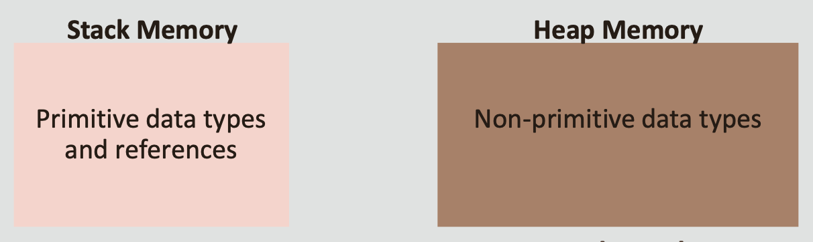
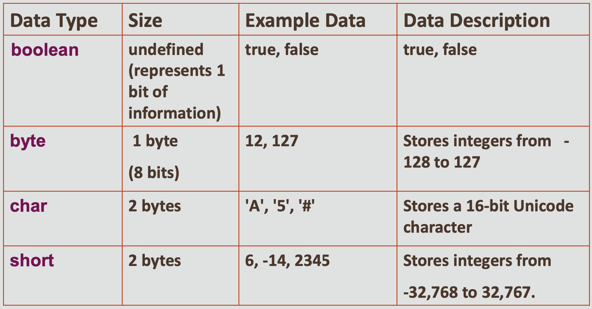

#  Java Programming 1-1 Fundamentals of Java - What I should know
## Objectives

* **This lesson reviews the following topics:**

    - Java Primitives
    - Strings
    - Logical and Relational Operators −Conditional Statements
    - Program Control
    - Object Classes
    - Constructor and Method Overloading − Inheritance

## Primitive Data Types
* **Java has eight primitive data types that are used to store data during a program's operation**
* **Primitive data types are a special group of data types that do not use the keyword new when initialized**
  

## Primitive Data Types
* **Java creates primitives as automatic variables that are not references and are stored in stack memory with the name of the variable**
  

* **The most common primitive types used in this course are int (integers) and double (decimals)**

## Primitive Data Types

